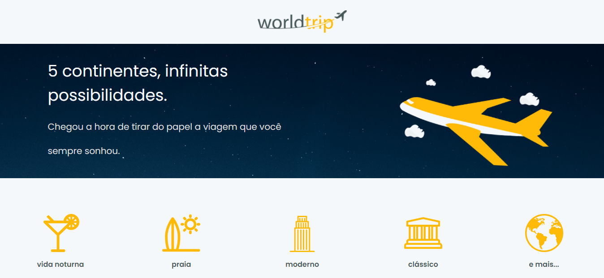
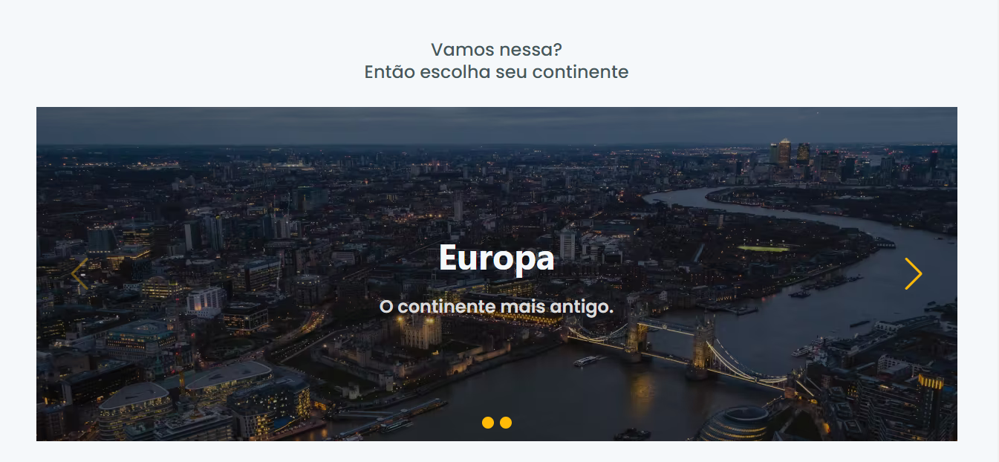

## WorldTrip ✈️

## Descrição

Aplicação desenvolvida como desafio do capítulo 4 do Ignite da Rocketseat. 
O objetivo era desenvolver de acordo com um layout do Figma, um site do zero utilizando a interface declarativa [Chakra UI](https://chakra-ui.com/). 

## O que foi feito? 

- Layout responsivo com Chakra UI
- Uso do CMS [Prismic](https://prismic.io/) como repositório do conteúdo do site
- Slides com [Swiper](https://swiperjs.com/react)
- Geração de páginas estáticas

## O que aprendi?

Com as aulas e o desafio proposto, consegui utilizar o básico do Chakra UI para construir interfaces. Aproveitei o conceito do CMS Prismic do outro módulo para ser a fonte dos meus dados, sendo assim usei a API do Prismic para obter os dados da aplicação, reforçando um pouco mais o seu uso.
Apliquei o conceito de geração de [páginas estáticas](https://nextjs.org/docs/basic-features/data-fetching) com o uso das funções getStaticPaths() e getStaticProps(), de forma que consegui ter as páginas dinâmicas que foram definidas em getStaticPaths(), pré-renderizadas com base nos dados retornados pela getStaticProps(). 
E por fim, utilizei o básico da biblioteca Swiper que fornece um componente de slides. 

## Dificuldades

De modo geral, tive dificuldade para identificar quais componentes do Chakra UI utilizar para montar a interface, entender um pouco da estilização, e a estilização do componente de slides.

## Como ficou? 

  
Versão web:

  
  

Você pode conferir [aqui](https://worldtrip-seven.vercel.app/)

Feito por [Bruna Barros](https://www.linkedin.com/in/bruna-barros-8180a4213/). 